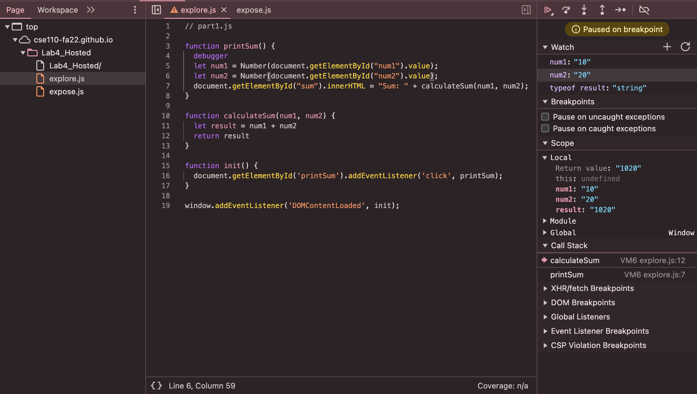

1. The bug was that the text that was being inputted by a user was in the form of a string, so the addition in the `calculateSum` function was actually performing string concatenation, instead of arithmetic operations as it was supposed to be doing.
2. I would fix this bug by converting the input values to numbers before performing any addition operation. 
